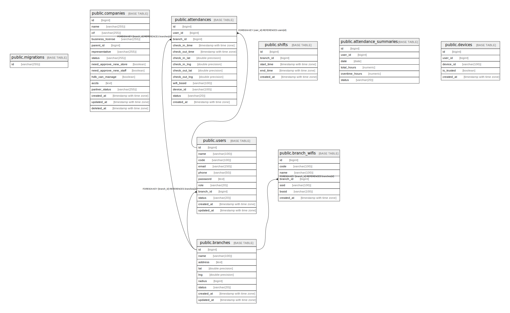

# dhdb

## Tables

| Name | Columns | Comment | Type |
| ---- | ------- | ------- | ---- |
| [public.migrations](public.migrations.md) | 1 |  | BASE TABLE |
| [public.companies](public.companies.md) | 15 |  | BASE TABLE |
| [public.branches](public.branches.md) | 9 |  | BASE TABLE |
| [public.users](public.users.md) | 11 |  | BASE TABLE |
| [public.branch_wifis](public.branch_wifis.md) | 7 |  | BASE TABLE |
| [public.attendances](public.attendances.md) | 13 |  | BASE TABLE |
| [public.shifts](public.shifts.md) | 5 |  | BASE TABLE |
| [public.attendance_summaries](public.attendance_summaries.md) | 6 |  | BASE TABLE |
| [public.devices](public.devices.md) | 5 |  | BASE TABLE |

## Relations

---

> Generated by [tbls](https://github.com/k1LoW/tbls)
