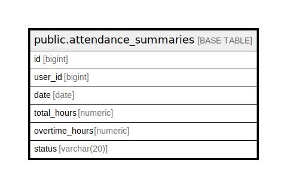

# public.attendance_summaries

## Description

## Columns

| Name | Type | Default | Nullable | Children | Parents | Comment |
| ---- | ---- | ------- | -------- | -------- | ------- | ------- |
| id | bigint | nextval('attendance_summaries_id_seq'::regclass) | false |  |  |  |
| user_id | bigint |  | true |  |  |  |
| date | date |  | true |  |  |  |
| total_hours | numeric |  | true |  |  |  |
| overtime_hours | numeric |  | true |  |  |  |
| status | varchar(20) |  | true |  |  |  |

## Constraints

| Name | Type | Definition |
| ---- | ---- | ---------- |
| attendance_summaries_pkey | PRIMARY KEY | PRIMARY KEY (id) |

## Indexes

| Name | Definition |
| ---- | ---------- |
| attendance_summaries_pkey | CREATE UNIQUE INDEX attendance_summaries_pkey ON public.attendance_summaries USING btree (id) |
| idx_attendance_summaries_user_id | CREATE INDEX idx_attendance_summaries_user_id ON public.attendance_summaries USING btree (user_id) |

## Relations

---

> Generated by [tbls](https://github.com/k1LoW/tbls)
