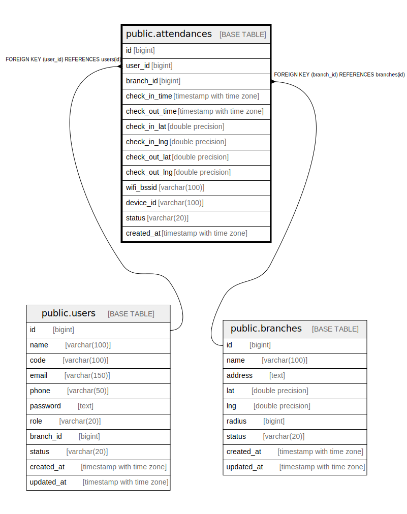

# public.attendances

## Description

## Columns

| Name | Type | Default | Nullable | Children | Parents | Comment |
| ---- | ---- | ------- | -------- | -------- | ------- | ------- |
| id | bigint | nextval('attendances_id_seq'::regclass) | false |  |  |  |
| user_id | bigint |  | false |  | [public.users](public.users.md) |  |
| branch_id | bigint |  | false |  | [public.branches](public.branches.md) |  |
| check_in_time | timestamp with time zone |  | true |  |  |  |
| check_out_time | timestamp with time zone |  | true |  |  |  |
| check_in_lat | double precision |  | true |  |  |  |
| check_in_lng | double precision |  | true |  |  |  |
| check_out_lat | double precision |  | true |  |  |  |
| check_out_lng | double precision |  | true |  |  |  |
| wifi_bssid | varchar(100) |  | true |  |  |  |
| device_id | varchar(100) |  | true |  |  |  |
| status | varchar(20) |  | true |  |  |  |
| created_at | timestamp with time zone |  | true |  |  |  |

## Constraints

| Name | Type | Definition |
| ---- | ---- | ---------- |
| fk_attendances_branch | FOREIGN KEY | FOREIGN KEY (branch_id) REFERENCES branches(id) |
| fk_attendances_user | FOREIGN KEY | FOREIGN KEY (user_id) REFERENCES users(id) |
| attendances_pkey | PRIMARY KEY | PRIMARY KEY (id) |

## Indexes

| Name | Definition |
| ---- | ---------- |
| attendances_pkey | CREATE UNIQUE INDEX attendances_pkey ON public.attendances USING btree (id) |
| idx_attendances_user_id | CREATE INDEX idx_attendances_user_id ON public.attendances USING btree (user_id) |
| idx_attendances_check_in_time | CREATE INDEX idx_attendances_check_in_time ON public.attendances USING btree (check_in_time) |
| idx_attendances_branch_id | CREATE INDEX idx_attendances_branch_id ON public.attendances USING btree (branch_id) |

## Relations

---

> Generated by [tbls](https://github.com/k1LoW/tbls)
