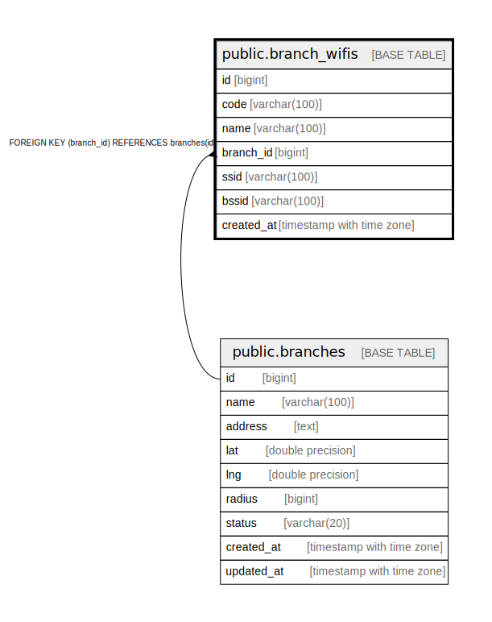

# public.branch_wifis

## Description

## Columns

| Name | Type | Default | Nullable | Children | Parents | Comment |
| ---- | ---- | ------- | -------- | -------- | ------- | ------- |
| id | bigint | nextval('branch_wifis_id_seq'::regclass) | false |  |  |  |
| code | varchar(100) |  | false |  |  |  |
| name | varchar(100) |  | false |  |  |  |
| branch_id | bigint |  | false |  | [public.branches](public.branches.md) |  |
| ssid | varchar(100) |  | true |  |  |  |
| bssid | varchar(100) |  | true |  |  |  |
| created_at | timestamp with time zone |  | true |  |  |  |

## Constraints

| Name | Type | Definition |
| ---- | ---- | ---------- |
| fk_branch_wifis_branch | FOREIGN KEY | FOREIGN KEY (branch_id) REFERENCES branches(id) |
| branch_wifis_pkey | PRIMARY KEY | PRIMARY KEY (id) |

## Indexes

| Name | Definition |
| ---- | ---------- |
| branch_wifis_pkey | CREATE UNIQUE INDEX branch_wifis_pkey ON public.branch_wifis USING btree (id) |
| idx_branch_wifis_branch_id | CREATE INDEX idx_branch_wifis_branch_id ON public.branch_wifis USING btree (branch_id) |

## Relations

---

> Generated by [tbls](https://github.com/k1LoW/tbls)
