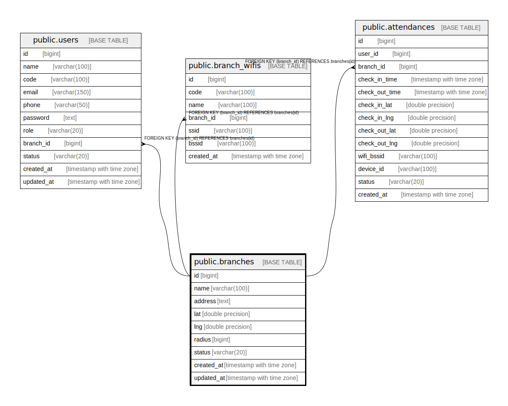

# public.branches

## Description

## Columns

| Name | Type | Default | Nullable | Children | Parents | Comment |
| ---- | ---- | ------- | -------- | -------- | ------- | ------- |
| id | bigint | nextval('branches_id_seq'::regclass) | false | [public.users](public.users.md) [public.branch_wifis](public.branch_wifis.md) [public.attendances](public.attendances.md) |  |  |
| name | varchar(100) |  | false |  |  |  |
| address | text |  | true |  |  |  |
| lat | double precision |  | true |  |  |  |
| lng | double precision |  | true |  |  |  |
| radius | bigint |  | true |  |  |  |
| status | varchar(20) | 'active'::character varying | true |  |  |  |
| created_at | timestamp with time zone |  | true |  |  |  |
| updated_at | timestamp with time zone |  | true |  |  |  |

## Constraints

| Name | Type | Definition |
| ---- | ---- | ---------- |
| branches_pkey | PRIMARY KEY | PRIMARY KEY (id) |

## Indexes

| Name | Definition |
| ---- | ---------- |
| branches_pkey | CREATE UNIQUE INDEX branches_pkey ON public.branches USING btree (id) |

## Relations

---

> Generated by [tbls](https://github.com/k1LoW/tbls)
