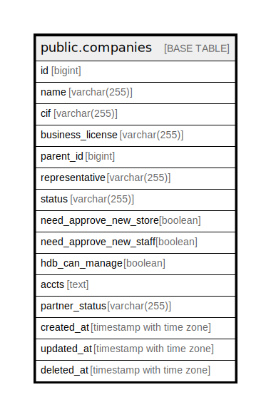

# public.companies

## Description

## Columns

| Name | Type | Default | Nullable | Children | Parents | Comment |
| ---- | ---- | ------- | -------- | -------- | ------- | ------- |
| id | bigint | nextval('companies_id_seq'::regclass) | false |  |  |  |
| name | varchar(255) |  | true |  |  |  |
| cif | varchar(255) |  | true |  |  |  |
| business_license | varchar(255) |  | true |  |  |  |
| parent_id | bigint |  | true |  |  |  |
| representative | varchar(255) |  | true |  |  |  |
| status | varchar(255) |  | true |  |  |  |
| need_approve_new_store | boolean | false | true |  |  |  |
| need_approve_new_staff | boolean | false | true |  |  |  |
| hdb_can_manage | boolean | false | true |  |  |  |
| accts | text | '{}'::text | true |  |  |  |
| partner_status | varchar(255) |  | true |  |  |  |
| created_at | timestamp with time zone |  | true |  |  |  |
| updated_at | timestamp with time zone |  | true |  |  |  |
| deleted_at | timestamp with time zone |  | true |  |  |  |

## Constraints

| Name | Type | Definition |
| ---- | ---- | ---------- |
| companies_pkey | PRIMARY KEY | PRIMARY KEY (id) |

## Indexes

| Name | Definition |
| ---- | ---------- |
| companies_pkey | CREATE UNIQUE INDEX companies_pkey ON public.companies USING btree (id) |
| idx_companies_deleted_at | CREATE INDEX idx_companies_deleted_at ON public.companies USING btree (deleted_at) |

## Relations

---

> Generated by [tbls](https://github.com/k1LoW/tbls)
