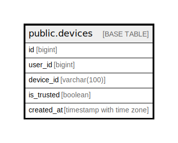

# public.devices

## Description

## Columns

| Name | Type | Default | Nullable | Children | Parents | Comment |
| ---- | ---- | ------- | -------- | -------- | ------- | ------- |
| id | bigint | nextval('devices_id_seq'::regclass) | false |  |  |  |
| user_id | bigint |  | true |  |  |  |
| device_id | varchar(100) |  | true |  |  |  |
| is_trusted | boolean | true | true |  |  |  |
| created_at | timestamp with time zone |  | true |  |  |  |

## Constraints

| Name | Type | Definition |
| ---- | ---- | ---------- |
| devices_pkey | PRIMARY KEY | PRIMARY KEY (id) |

## Indexes

| Name | Definition |
| ---- | ---------- |
| devices_pkey | CREATE UNIQUE INDEX devices_pkey ON public.devices USING btree (id) |
| idx_devices_user_id | CREATE INDEX idx_devices_user_id ON public.devices USING btree (user_id) |

## Relations

---

> Generated by [tbls](https://github.com/k1LoW/tbls)
