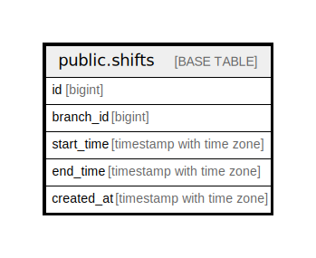

# public.shifts

## Description

## Columns

| Name | Type | Default | Nullable | Children | Parents | Comment |
| ---- | ---- | ------- | -------- | -------- | ------- | ------- |
| id | bigint | nextval('shifts_id_seq'::regclass) | false |  |  |  |
| branch_id | bigint |  | true |  |  |  |
| start_time | timestamp with time zone |  | true |  |  |  |
| end_time | timestamp with time zone |  | true |  |  |  |
| created_at | timestamp with time zone |  | true |  |  |  |

## Constraints

| Name | Type | Definition |
| ---- | ---- | ---------- |
| shifts_pkey | PRIMARY KEY | PRIMARY KEY (id) |

## Indexes

| Name | Definition |
| ---- | ---------- |
| shifts_pkey | CREATE UNIQUE INDEX shifts_pkey ON public.shifts USING btree (id) |
| idx_shifts_branch_id | CREATE INDEX idx_shifts_branch_id ON public.shifts USING btree (branch_id) |

## Relations

---

> Generated by [tbls](https://github.com/k1LoW/tbls)
