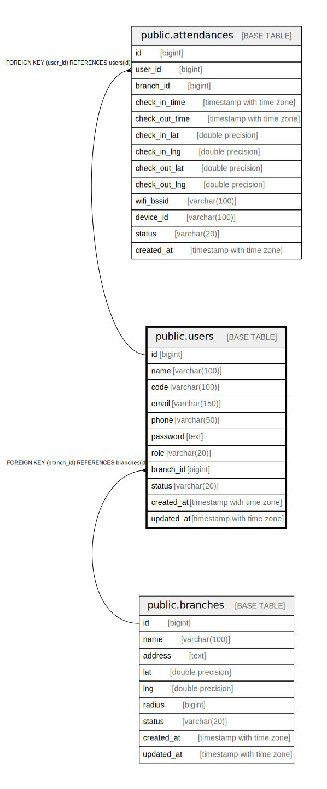

# public.users

## Description

## Columns

| Name | Type | Default | Nullable | Children | Parents | Comment |
| ---- | ---- | ------- | -------- | -------- | ------- | ------- |
| id | bigint | nextval('users_id_seq'::regclass) | false | [public.attendances](public.attendances.md) |  |  |
| name | varchar(100) |  | false |  |  |  |
| code | varchar(100) |  | false |  |  |  |
| email | varchar(150) |  | false |  |  |  |
| phone | varchar(50) |  | true |  |  |  |
| password | text |  | false |  |  |  |
| role | varchar(20) |  | false |  |  |  |
| branch_id | bigint |  | true |  | [public.branches](public.branches.md) |  |
| status | varchar(20) | 'active'::character varying | true |  |  |  |
| created_at | timestamp with time zone |  | true |  |  |  |
| updated_at | timestamp with time zone |  | true |  |  |  |

## Constraints

| Name | Type | Definition |
| ---- | ---- | ---------- |
| fk_users_branch | FOREIGN KEY | FOREIGN KEY (branch_id) REFERENCES branches(id) |
| users_pkey | PRIMARY KEY | PRIMARY KEY (id) |

## Indexes

| Name | Definition |
| ---- | ---------- |
| users_pkey | CREATE UNIQUE INDEX users_pkey ON public.users USING btree (id) |
| idx_users_branch_id | CREATE INDEX idx_users_branch_id ON public.users USING btree (branch_id) |
| idx_users_email | CREATE UNIQUE INDEX idx_users_email ON public.users USING btree (email) |

## Relations

---

> Generated by [tbls](https://github.com/k1LoW/tbls)
